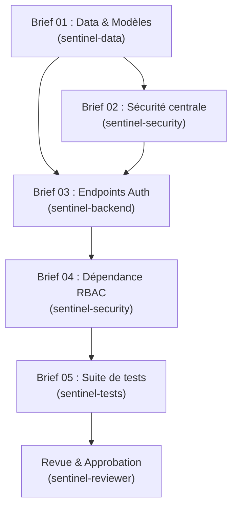

# Sentinel — Briefs d'exécution de la Phase 1

> **Phase 1** : Authentification, Utilisateurs & Contrôle d'accès (RBAC)  
> **Auteur** : `@sentinel-architect`  
> **Source de vérité** : [`AGENTS.md`](file:///home/manassecodev/dev/Sentinel/AGENTS.md), [`docs/data-model.md`](file:///home/manassecodev/dev/Sentinel/docs/data-model.md), [`docs/rbac-matrix.md`](file:///home/manassecodev/dev/Sentinel/docs/rbac-matrix.md)

---

## 1. Vue d'ensemble des 5 briefs

| # | Brief | Agent destinataire | Branche suggérée | Objectif clé |
|---|---|---|---|---|
| **01** | [`01-data-auth-models.md`](file:///home/manassecodev/dev/Sentinel/docs/briefs/01-data-auth-models.md) | `@sentinel-data` | `feat/data-auth-models` | Modèles SQLAlchemy 2.0, migration Alembic, seed des rôles/permissions |
| **02** | [`02-security-core.md`](file:///home/manassecodev/dev/Sentinel/docs/briefs/02-security-core.md) | `@sentinel-security` | `feat/security-core` | Hachage argon2id, utilitaires JWT, gestion du lockout |
| **03** | [`03-auth-endpoints.md`](file:///home/manassecodev/dev/Sentinel/docs/briefs/03-auth-endpoints.md) | `@sentinel-backend` | `feat/auth-endpoints` | Endpoints `/api/v1/auth/*` (`login`, `refresh`, `logout`, `me`) |
| **04** | [`04-rbac-dependency.md`](file:///home/manassecodev/dev/Sentinel/docs/briefs/04-rbac-dependency.md) | `@sentinel-security` | `feat/rbac-dependency` | Dépendances `get_current_user` et `requires(...)` |
| **05** | [`05-tests-auth-rbac.md`](file:///home/manassecodev/dev/Sentinel/docs/briefs/05-tests-auth-rbac.md) | `@sentinel-tests` | `test/auth-rbac` | Suite de tests automatisés pytest (auth + matrice RBAC) |

---

## 2. Graphe des dépendances



---

## 3. Workflow d'exécution pour chaque brief

1. Créer la branche dédiée (`git checkout -b <branche>`).
2. Convoquer l'agent assigné avec la commande :
   ```text
   @<agent> Exécute le brief : docs/briefs/NN-<slug>.md
   ```
3. Vérifier la conformité de l'implémentation (tests, linter, typage).
4. Solliciter `@sentinel-reviewer` pour la validation du diff.
5. Commiter avec le formalisme *Conventional Commits* et merger sur `main`.
